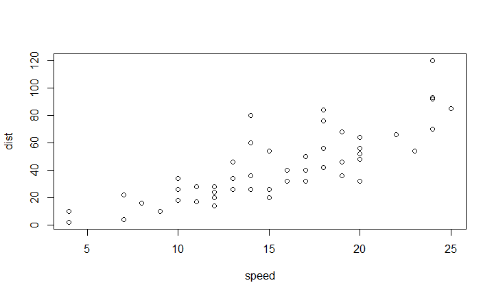

# Data Science & R Programming
Joe Bragg  
Sunday, September 14, 2014  

## What is Data Science?

Data science is the study of the generalizable **extraction of knowledge** from data. The key word is **science**.

It incorporates varying elements and builds on techniques and theories from many fields, including signal processing, mathematics, probability models, machine learning, statistical learning, computer programming, data engineering, pattern recognition and learning, visualization, uncertainty modeling, data warehousing, and high performance computing with the goal of **extracting meaning** from data and creating data products.

http://en.wikipedia.org/wiki/Data_science

## Steps Data Scientists Use

* Define the question/objective
* Define the ideal data set
* Determine what data can be accessed
* Obtain the data
* Clean the data
* Explore and summarize the data
* Construct statistical models and predictions
* Interpret results
* Challenge results
* Write up results
* Create reproducible code
* Distribute results to other people (Peer Review)

## Data Scientist Tools

* Programming language(s)
    + R, Python, T-SQL, C/C++, etc.
    
* Programming modules, packages, add-ons and Application Programming Interfaces (APIs)

* Documentation Tools
    + Markdown, R Markdown, Python Markdown, HTML, PDF, etc.
    
* Version Control System (VCS)
    + Git, Subversion, CVS, etc.
    
* Distribution/publishing system
    + GitHub, SourceForge, Google Code, etc.
    
# R Programming

## R "Atomic" Classes (Data Types)
    
+---------------+---------------+--------------------+
| Data Type     | Example       | Comments           |
+===============+===============+====================+
|Character      | "A", "f", "4",|                    |
|               | "$", "Hello"  |                    |
+---------------+---------------+--------------------+
|Numeric        | 2.10, 4, -2,  | - Inf = 1/0        |
|(real numbers) | Inf, NaN      | - Nan = 0/0        |
+---------------+---------------+--------------------+
|Integer        |12**L**, 0:8   | - L makes the number |
|               |               | an integer         |
|               |               | - 0:8 = 0 1 2 3 4 5 6 7 8|
+---------------+---------------+--------------------+
|Complex        |1+2i, 4i       | - Re() function gives real part|
|               |               | - Im() function gives imaginary part|
+---------------+---------------+--------------------+
|Logical        |TRUE or FALSE, |                    |
|               |T or F         |                    |
+---------------+---------------+--------------------+
    
## Vectors
    Can only contain objects of the same class

```r
      vn<-c(4,2.1,5,6.4,7)  ## numeric vector
      print(vn)
```

```
## [1] 4.0 2.1 5.0 6.4 7.0
```


```r
      vc<-c("d","S","12","Hello")  ## character vector
      print(vc)
```

```
## [1] "d"     "S"     "12"    "Hello"
```

## Matrices
    Like a vector can only contain objects of the same class

```r
      m <- matrix(1:12, nrow = 3, ncol = 4)  ##interger matrix
      print(m)
```

```
##      [,1] [,2] [,3] [,4]
## [1,]    1    4    7   10
## [2,]    2    5    8   11
## [3,]    3    6    9   12
```


```r
      class(m[1,1])
```

```
## [1] "integer"
```

## Lists
    Can contain objects of different classes

```r
      l<-list(4,"List",TRUE,1+2i)
      print(l)
```

```
## [[1]]
## [1] 4
## 
## [[2]]
## [1] "List"
## 
## [[3]]
## [1] TRUE
## 
## [[4]]
## [1] 1+2i
```

## Data Frames
    
## Slide with R Code and Output


```r
summary(cars)
```

```
##      speed           dist    
##  Min.   : 4.0   Min.   :  2  
##  1st Qu.:12.0   1st Qu.: 26  
##  Median :15.0   Median : 36  
##  Mean   :15.4   Mean   : 43  
##  3rd Qu.:19.0   3rd Qu.: 56  
##  Max.   :25.0   Max.   :120
```

## Slide with Plot

 

